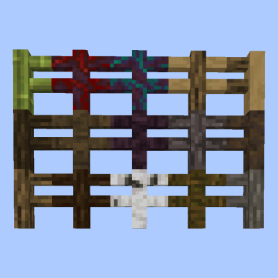

# Log Fences



[English](README.md)

バニラのすべての木に、原木の見た目のフェンスとフェンスゲートを追加する Minecraft の MOD です。
斧で部位ごとに樹皮を剥いで、見た目をカスタマイズできます。

> **状態:** Minecraft 26.3 / NeoForge 向けの 1.0.0 Beta。CurseForge で公開予定です。変更履歴は [CHANGELOG.md](CHANGELOG.md) を見てください。

## 機能

- **原木のフェンス・フェンスゲート**（13 種類）: オーク、トウヒ、シラカバ、ジャングル、アカシア、ダークオーク、マングローブ、サクラ、ペールオーク、ポプラ、竹ブロック、真紅の幹、歪んだ幹。
  バニラの木のフェンス・ゲートと同じように動き、バニラのものとも繋がります。
- **部位ごとの樹皮剥ぎ**: 斧で右クリックすると、クリックした部位だけ樹皮が剥がれます。
  - フェンス: 柱／上の横木／下の横木（8 通り）
  - フェンスゲート（閉じているとき）: 両端の柱／内側の縦木／上の横木／下の横木（16 通り）
  - 剥がれ済みの部位や開いているゲートを右クリックすると、通常の動作（リード・開閉）になります
- **剥いだ版**: 樹皮を剥いだ原木からクラフトすると、置いた時点で全部位が剥がれたフェンス・ゲートが手に入ります。
  全部位が剥がれたフェンス・ゲートを壊すと、剥いだ版がドロップします。
- 硬さ・音・燃えやすさ（ネザーの木は燃えない）・かまどの燃料は、バニラの木のフェンスと同じです。
- バニラの原木のテクスチャを使うので、リソースパックにも対応します。

## 他 MOD との互換性

- [Diagonal Fences](https://modrinth.com/mod/diagonal-fences): 一緒に使えますが、原木のフェンスは斜めには繋がりません（バニラと同じ 4 方向の繋がりのままです）。

## レシピ

| 完成品 | レシピ |
|---|---|
| 原木のフェンス ×12 | `原 棒 原` / `原 棒 原`（原 = 原木） |
| 原木のフェンスゲート ×4 | `棒 原 棒` / `棒 原 棒` |
| 竹ブロックのフェンス ×6／ゲート ×2 | 竹ブロックで同じ形 |
| 剥いだ版 | 樹皮を剥いだ原木で同じ形 |

個数はバニラの板材のレシピに合わせています（原木 1 個 = 板材 4 枚、竹ブロック 1 個 = 板材 2 枚）。

## 動作環境

- Minecraft 26.3
- NeoForge 26.3.0.42-beta 以降
- クライアントとサーバーの両方に必要です。

## ビルド

```sh
./gradlew build
```

`build/libs/logfences-neoforge-<Minecraft バージョン>-<MOD バージョン>.jar` ができます。Java 25 は Gradle が自動でダウンロードします。

そのほかのタスク:

- `./gradlew runClient` — 開発用クライアントを起動
- `./gradlew runData` — モデル・言語ファイル・タグ・ルートテーブル・レシピを `src/generated/` に再生成
- `./gradlew runGameTestServer` — GameTest を実行

## ライセンス

[MIT](LICENSE)
